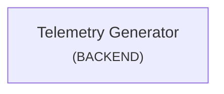

<!-- generated:start file:system-map -->
> These architecture docs are **not verified at the current commit** (no full drift sweep has run yet). Treat them as a snapshot and verify against source before relying on them.

# System Map

## Components

- [Telemetry Generator](overview.md) (`telemetry-generator`, backend)
<!-- generated:end file:system-map -->
