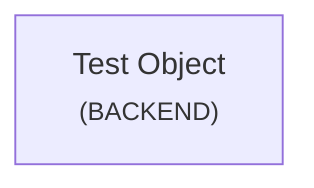

<!-- generated:start file:system-map -->
# System Map

```mermaid
graph TD
    test-object["Test Object <br/> <small>(BACKEND)</small>"]
```

## Components

- [Test Object](overview.md) (`test-object`, backend)
<!-- generated:end file:system-map -->
